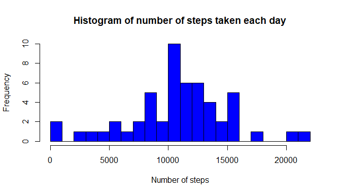
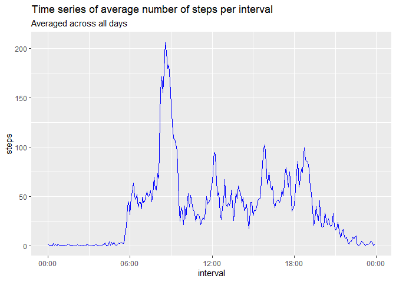
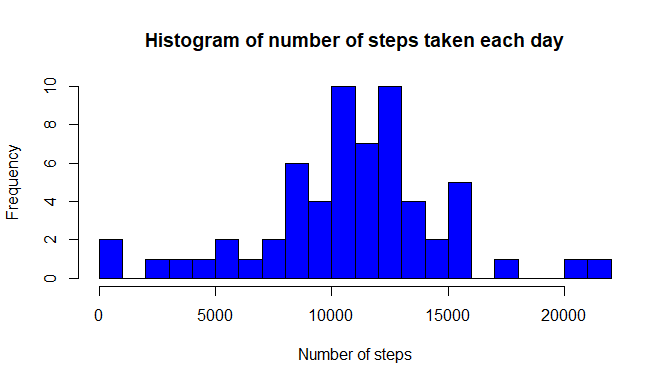
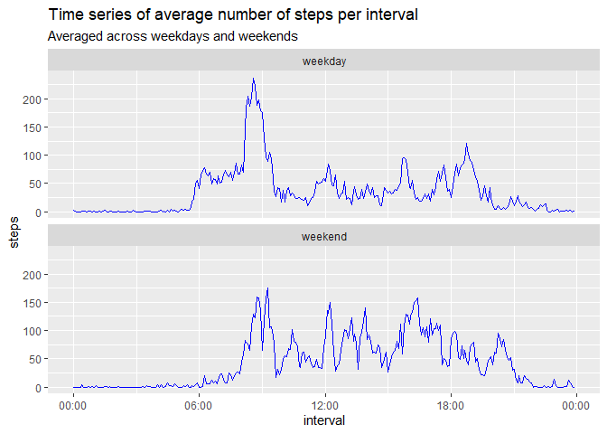

## Loading and pre-processing the data
Here we simply load the data. Relevant preprocessing will be undertaken immediately prior to creating charts and making calculations. 

```r
data <- read.csv("./data/activity.csv")
```

## What is the mean total number of steps taken per day?
We make the necessary calculations then create a histogram showing the total number of steps taken each day.

```r
library(dplyr)
data_grouped <- group_by(data, date)
daily <- summarize(data_grouped, steps = sum(steps, na.rm = FALSE))
hist(daily$steps, breaks = 20,
     main = "Histogram of number of steps taken each day",
     xlab = "Number of steps",
     col = "blue")
```

<!-- -->

Now we calculate the mean and median number of steps taken each day.

```r
options(digits = 0, scipen = 999)
mean <- mean(daily$steps, na.rm = TRUE)
median <- median(daily$steps, na.rm = TRUE)
```
The mean number of steps taken each day is 10766. 
The median number of steps taken each day is 10765.

Note that this result occurs when we "completely" ignore those days for which there are no obvservations. If we would include those days as having "zero" steps, the mean and median would be lower. 

##What is the average daily activity pattern?
We create a time series plot of the average number of steps taken at intervals during the day.

```r
library(dplyr)
data_int <- group_by(data, interval)
int <- summarize(data_int, steps = mean(steps, na.rm = TRUE))
# NB: The next 4 lines of code reconstruct the time interval series so that it can be read properly for plotting purposes.
time <- as.data.frame(format(seq.POSIXt(as.POSIXct(Sys.Date()), 
                                        as.POSIXct(Sys.Date()+1), by = "5 min"), 
                             "%H:%M", tz = "GMT"))
time <- as.data.frame(time[1:288,1])
int$time <- time[1:288,1]
int$interval <- as.POSIXct(int$time, "%H:%M", tz = "GMT")
library(ggplot2)
g <- ggplot(int, aes(interval, steps))
g + geom_line(colour = "blue", group = 1) +
      labs(title = "Time series of average number of steps per interval",
           subtitle = "Averaged across all days") +
      scale_x_datetime(date_labels = "%H:%M")
```

<!-- -->

Now we find the 5-minute interval that, on average, contains the maximum number of steps.

```r
max <- filter(int, steps == max(steps, na.rm = TRUE)) 
answer <- max$time[1]
```
The 5-minute interval that, on average, contains the maximum number of steps is the one that starts at 08:35.

##Imputing missing data

```r
missing <- sum(is.na(data$steps))  
```
Our original dataset contains 2304 missing values.

To deal with the missing data, we compute the average steps taken for each time interval on each day of the week. If a value is missing we then impute with the average values from the same weekday and time interval in other weeks. 

```r
data_imp <- data
# We add the days of the week to our data
data_imp$day <- weekdays(as.Date(data_imp$date))
# We calculate the average steps for each interval and day of the week
data_grouped <- group_by(data_imp, day, interval)
weekday <- summarize(data_grouped, steps = mean(steps, na.rm = TRUE))
weekday$impute <- weekday$steps
weekday <- subset(weekday, select = -steps)
# We include this calculation in our dataset and use it to replace those values that are missing
data_imp <- merge(data_imp, weekday, by = c("interval", "day"))
for (i in 1:17568) {
      if (is.na(data_imp$steps[i])) {
            data_imp$steps[i] <- data_imp$impute[i]
      } 
}
# Finally we check we have actually removed all missing values
check <- sum(is.na(data_imp$steps))  
```
After checking, we verify that our new dataset contains 0 missing values.

We make another histogram of the total number of steps taken each day after missing values have been imputed.

```r
data_imp <- group_by(data_imp, date)
daily_imp <- summarize(data_imp, steps = sum(steps))
hist(daily_imp$steps, breaks = 20,
     main = "Histogram of number of steps taken each day",
     xlab = "Number of steps",
     col = "blue")
```

<!-- -->

```r
options(digits = 0, scipen = 999)
mean_imp <- mean(daily_imp$steps, na.rm = TRUE)
median_imp <- median(daily_imp$steps, na.rm = TRUE)
```
The mean number of steps taken each day after imputing missing values is 10821. 
The median number of steps taken each day after imputing missing values is 11015.  
The total number of steps thus increases, as we would expect, after imputing missing values. The histogram also resembles slighty more a normal distribution. 


##Are there differences in activity patterns between weekdays and weekends?
We create a panel plot comparing the average number of steps taken per 5-minute interval across weekdays and weekend.

```r
data_imp$weekday <- NA
for (i in 1:17568) {
      if(data_imp$day[i] == "Saturday" | data_imp$day[i] == "Sunday" )
            data_imp$weekday[i] <- "weekend"
      else data_imp$weekday[i] <- "weekday"
}
data_int_imp <- group_by(data_imp, weekday, interval)
int_imp <- summarize(data_int_imp, steps = mean(steps, na.rm = TRUE))
time <- as.data.frame(format(seq.POSIXt(as.POSIXct(Sys.Date()), 
                                        as.POSIXct(Sys.Date()+2), 
                                        by = "5 min"), "%H:%M", tz = "GMT"))
time <- as.data.frame(time[1:576,1])
int_imp$interval[1:576] <- time[1:576,1]
int_imp$interval <- as.POSIXct(int_imp$interval, "%H:%M", tz = "GMT")

library(ggplot2)
g <- ggplot(int_imp, aes(interval, steps), height = 2)
g + geom_line(colour = "blue") +
      labs(title = "Time series of average number of steps per interval",
           subtitle = "Averaged across weekdays and weekends") +
      scale_x_datetime(date_labels = "%H:%M") +
      facet_wrap(~ weekday, nrow = 2)
```

<!-- -->


We can see how activity on weekdays peakes strongly during the morning rushour and is then much lower during the rest of the day (although there are also peaks during the lunch and afternoon rush hours). At the weekend, activity picks up later in the morning and is more spread out over the course of the day.
